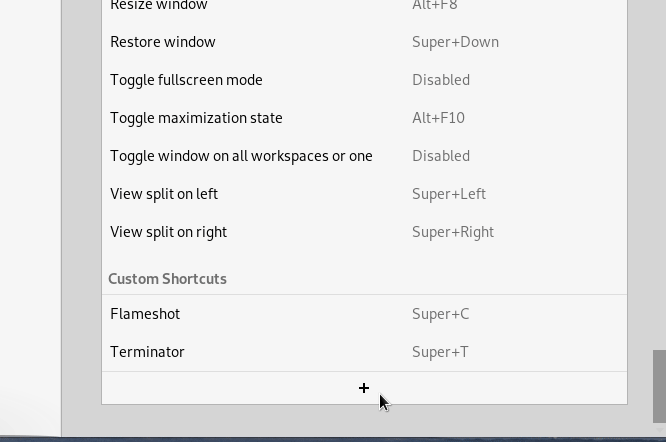
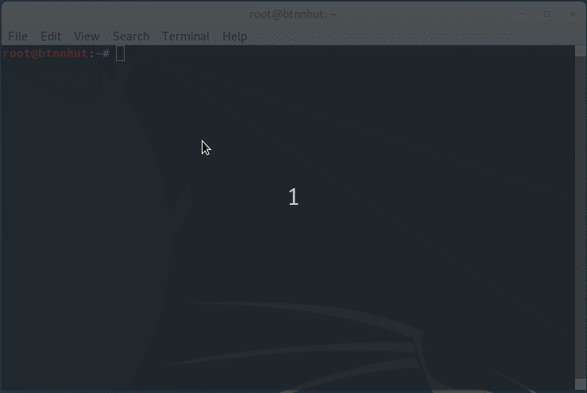

# KALI LINUX 2019.4
---
Mục đích viết tài liệu lưu lại để khi quên xem lại :+))), tại dạo này mình hay quên mà... 


>#### Mà vừa nói gì vậy :D...

<br />

# MỤC LỤC:

---

- ### [I. Những việc cần làm khi install Kali Linux](#I)

	- [1. Môi trường thực hiện](#I_01)
	- [2. Tạo Bootable USB Drive và cài đặt KaLi Linux](#I_02)
	- [3. Một số cài đặt căn bản sau khi Install Kali Linux](#I_03)

- ### [II. Một số lệnh Kali Linux:](#II)
	- [1. Lệnh hệ thống:](#lenhhethong)
	- [2. Lệnh thông dụng: <br />ls - pwd - mkdir - cd - rmdir - rm - cp - mv - cat - tail - less - grep - find -clear - history - touch- <br />Giải nén file .ZIP - .gz - .tar - .tar.xz - .tar.bz2 - .tar.gz - .7z - .rar - .gzip - .zip ](#lenhthongdung)
	- [3. Những Package hay cho Linux](#II_03)
		- [3.1 Peek](#II_03_01) 
		- [3.2 Flameshot](#II_03_02) 
		- [3.1 Sublime Text](#II_03_03)
		- [3.4 Inkscape](#II_03_04) 
		
- ### [III. Link tham khảo:](#III)<br />

<br />

<a name="I"></a>
## [I. Những việc cần làm khi install Kali Linux](#I)

<a name="I_01"></a>

- [1. Môi trường thực hiện:](#I_01)

Thực hiện trên distro Kali Linux 2019.4

+ Operating system: Linux version 5.2.0-kali3-amd64 (NAME="Kali GNU/Linux", VERSION="2019.4")

---

<a name="I_02"></a>

- [2. Tạo Bootable USB Drive và cài đặt KaLi Linux](#I_02)

	+ Download distro Kali Linux mới nhất [tại đây](https://www.kali.org/downloads/) hoặc [tại đây](http://cdimage.kali.org/kali-images/kali-weekly/)

	+ Tạo USB Boot [tại đây](https://docs.kali.org/downloading/kali-linux-live-usb-install), hoặc theo mẫu sau:

```
sudo fdisk -l

dd if=kali-linux-2017.1-amd64.iso of=/dev/sdb bs=512k

```

Trong đó ```/dev/sdb``` đường dẫn đến USB

+ Tiến thành install theo [hướng dẫn](https://docs.kali.org/installation/kali-linux-hard-disk-install)

---

<a name="I_03"></a>

- [3. Một số cài đặt căn bản sau khi install KaLi Linux](#I_03)<!-- &emsp; -->

	- **3.1 Chạy những lệnh sau để cập nhật**

	```
	sudo apt-get -f install
	sudo apt-get update && sudo apt-get upgrade && sudo apt dist-upgrade
	reboot
	```

	- **3.2 Cài đặt ibus-unikey, tìm hiểu phương thức [Ibus](https://vi.wikipedia.org/wiki/Ibus)**

	```
	apt-get install ibus-unikey
	ibus restart
	```
	
	>Trường hợp version Linux chưa có sẵn gói package ibus-unikey thì chạy 2 command sau
	
	```
	sudo add-apt-repository ppa:ubuntu-vn/ppa
	sudo apt-get update
	```

	- **3.3 Cài đặt package ```alsa-utils```, để speaker luôn trạng thái On**
	
	```
	apt-get install alsa-utils -y
	```

	- **3.4 Cài đặt Microsoft Fonts**
	
	```
	apt-get install ttf-mscorefonts-installer
	```

	- **3.5 Cài đặt Lib32, một số soft chạy trên nền tảng Linux 32 bit cần bộ package này**
	
	```
	dpkg --add-architecture i386 && apt-get update && apt-get install wine32
	apt-get install lib32gcc1 libc6-i386 lib32z1 lib32stdc++6
	apt-get install g++-multilib
	```

	- **3.6 Install Nvidia GPU Drivers theo hướng dẫn [tại đây](https://docs.kali.org/general-use/install-nvidia-drivers-on-kali-linux) hoặc install mẫu sau:**
	
	```
	apt install -y ocl-icd-libopencl1 nvidia-driver nvidia-cuda-toolkit
	```

	- **3.7 Install Terminator**

	> Tìm hiểu thêm tại [đây](https://github.com/albfan/terminator) hoặc [đây](https://gnometerminator.blogspot.com/p/introduction.html)

	```
	apt-get install terminator
	```

	> Cài đặt terminator trong Debian Linux

	```
	terminator
	```

	>Create shortcut Hotkey

	- **3.8 Install Nautilus**

	> [Nautilus](https://vi.wikipedia.org/wiki/Nautilus_(ph%E1%BA%A7n_m%E1%BB%81m)) đây là một Package quản lý tập tin chính thức trong môi trường GNOME, download tại [đây](https://projects.flogisoft.com/nautilus-terminal/download/)

	```
	tar -zxvf nautilus-terminal_1.0_src.tar.gz
	cd nautilus-terminal_1.0_src
	./install.sh -i
	```

	> Cài đặt nautilus

	

	> Create shortcut Hotkey

	- **3.9 Remove những Package đã cũ**
	
	```
	sudo apt autoremove
	```

<br />

<a name="II"></a>
## [II. Một số lệnh Kali Linux:](#II)

---

<a name="lenhhethong"></a>

<a name="II_01"></a>

#### [1. Lệnh hệ thống:](#II_01)

- **1.1 Install file .deb**

```
dpkg -i file.deb
```

- **1.2 Install file .sh**

```
bash file.sh

```

**Mẹo:** để remove đổi tham số ```-i``` thành ```-r```

```
uname -r
cat /proc/version
cat /etc/os-release
lsb_release -a
cat /proc/cpuinfo
free -m
fdisk -l
df -h
df -Th
lsblk -f
```

> Xem thông tin hệ thống (version, ổ cứng, ram cpu,...)

- **1.3 apt**

```
apt-cache search name_package

```

> Tìm kiếm name_package có trong KaLi Linux không

```
apt list --upgradable

```

> Danh sách những package chưa upgrade

- **1.4 Thay đổi giờ trong KaLi Linux**

```
dpkg-reconfigure tzdata
```



<br />

<a name="lenhthongdung"></a>

<a name="II_02"></a>

#### [2. Lệnh thông dụng:](#II_02)

- **2.1 ls - List**

```ls``` liệt kê nội dung (file và thư mục) trong thư mục hiện hành.

- **2.2 pwd - Print Working Directory**

```pwd``` in ra đường dẫn đầy đủ đến thư mục hiện hành.

- **2.3 mkdir - Make Directory**

```mkdir <name_folder>``` tạo một thư mục mới

- **2.4 cd - Change Directory**

```cd <folder>``` chuyển đến một thư mục hiện hành.

- **2.5 rmdir - Remove Directory**

```rmdir <name_folder>``` xóa một thư mục.

- **2.6 rm - Remove**

```rm options <name_file>``` Xóa file. 

> options 
>
> ```-i``` : nhắn nhở khi xóa 
>
> ```-d``` : xóa một thư mục rỗng
>
> ```-r``` : xóa tất cả folder và file trong folder xóa
>
> ```-f``` : xóa tất cả không cần quyền root

**Mẹo:** dùng ```rm -r <name_folder>``` để xóa thư mục và toàn bộ dữ liệu trong thư mục đó.

- **2.7 cp - Copy**

```cp <file_nguồn> <file_đích>``` sao chép file từ vị trí nguồn đến vị trí đích.

**Mẹo:** dùng ```cp -r <folder_nguồn> <foler_đích>``` để sao chép thư mục và toàn bộ dữ liệu bên trong.

- **2.8 mv - Move**

```mv <nguồn> <đích>``` di chuyển một file hoặc thư mục từ vị trí này sang vị trí khác. 

**Mẹo:** Lệnh này dùng để đổi tên file hoặc thư mục nếu như ```<nguồn>``` và ```<đích>``` là cùng một thư mục.

- **2.9 cat - concatenate and print files**

```cat <name_file>``` đọc và in ra nội dung của file ra màn hình.

- **2.10 tail - print TAIL**

```tail <name_file>``` đọc và in ra nội dung 10 dòng cuối cùng của file (mặc định). 

**Mẹo:** Bạn có thể sử dụng ```tail -n N <name_file>``` để chỉ định in N dòng ra màn hình.

- **2.11 less - print LESS**

```less <name_file>``` in ra nội dung của một file theo từng trang trong trường hợp nội dung của file quá lớn và phải đọc theo trang. 

**Mẹo:** Bạn có thể dùng **Ctrl+F** để chuyển trang tiếp theo và **Ctrl+B** để chuyển về trang trước.

- **2.12 grep**

```grep <chuỗi> <name_file>``` tìm kiếm nội dung của file theo ```<name_file>``` cung cấp.

**Mẹo:** có thể dùng ```grep -i <chuỗi> <name_file>``` để tìm kiếm không phân biệt hoa thường hoặc ```grep -r <chuỗi> <name_folder>``` để tìm kiếm trong toàn thư mục.

- **2.13 find**

```find <thư mục> -name <name_file>``` tìm kiếm file trong ```<thư mục>``` theo ```<name_file>```.

**Mẹo:** có thể dùng ```find <thư mục> -iname <name_file>``` để tìm kiếm không phân biệt hoa thường.

- **2.14 clear**

```clear``` xóa hết lệnh trong cửa sổ Terminal.


- **2.15 history**

```history``` xem lại lịch sử lệnh Terminal đã dùng.

**Mẹo:** khi xem lịch sử lệnh trong Terminal, muốn sử dụng lại lệnh dòng nào thêm ```!số_dòng```

- **2.16 touch**

```touch file_name.*``` tạo ra file_name có đuôi là *

- **2.17 Giải nén file .ZIP**

```unzip /path/file.zip```

```unzip /path/file.zip -d /path_other/folder_new```

Để giải nén vào thư mục khác, thêm tham số ```-d```

```unzip -o /path/folder_new/file.zip```

Muốn các file được giải nén sẽ thay thế các file cũ đã có trong folder cần giải nén, ta thêm tham số ```-o```

- **2.18 Giải nén gile .gz**

```gunzip file.gz```

- **2.19 .tar**

```
tar -cvf name_file.tar <file1 hoặc file2...>

```

Tạo file nén (.tar) từ các file có sẵn.

```tar -tvf file.tar```

Xem nội dung file nén (.tar).

```tar -xvf file.tar```

Giải nén (file .tar).

- **2.20 Giải nén file .tar.xz**

```tar -xJf file.tar.xz```

- **2.21 Giải nén file .tar.bz2**

```
tar -xjf file.tar.bz2

```

- **2.22 Giải nén .tar.gz**

```
tar -xf file.tar.gz

```

- **2.23 Gải nén file .7z**

```7z x file.7z```

- **2.24 Giải nén file .rar**

```
unrar x file.rar

7zip x file.rar

```

- **2.25 .gz**

```
gzip name_file.gz

``` 

Tạo file nén (.gz)

```
gzip -d name_file.gz

``` 

Để giải nén (file .gz).

- **2.26 .zip**

```
unzip file.zip

```
Giải nén một file nén (.zip).

```
unzip -l file.zip

```
Để xem nội dung file zip mà không cần giải nén.

<a name="II_03"></a>

#### [3. Những Package hay cho Linux](#II_03)

<a name="II_03_01"></a>

- [**3.1 Peek**](#II_03_01)

>Đây là package tạo file .gif, tìm hiểu GIF [tại đây](https://en.wikipedia.org/wiki/GIF)

```
sudo add-apt-repository ppa:peek-developers/stable
```

> Thêm vào kho chứa (repository) phần mềm vào hệ thống

```
sudo apt update
sudo apt install peek
```

> Cập nhật hệ thống và cài đặt phần mềm

```
peek gui
```

> Create Shortcut Hotkey

<a name="II_03_02"></a>

- [**3.2 Flameshot**](#II_03_02)

>Đây là một package chụp ảnh màn hình nhẹ và có nhiều tính năng chỉnh sửa ảnh, tìm hiểu thêm [tại đây](https://flameshot.js.org/#/getting-start)

```
apt install flameshot
```

> Cài đặt flameshot

```
flameshot gui
```

> Create Shortcut Hotkey 

<a name="II_03_03"></a>

- [**3.3 Sublime Text**](#II_03_03)

>Package Sublime Text để soạn thảo văn bản được dùng nhiều bởi web developers, coders và programmers, tìm hiểu thêm [tại đây](https://www.sublimetext.com/), hoặc cài đặt chi tiết [tại đây](/README_SUBLIME_TEXT.md)

```
wget -qO - https://download.sublimetext.com/sublimehq-pub.gpg | sudo apt-key add -

sudo apt-get install apt-transport-https

echo "deb https://download.sublimetext.com/ apt/stable/" | sudo tee /etc/apt/sources.list.d/sublime-text.list

sudo apt-get update

sudo apt-get install sublime-text

```

<a name="II_03_04"></a>

- [**3.4 Inkscape**](#II_03_04)

[link Inkscape](https://inkscape.org/)

```
apt-get install inkscape -Y
```

<a name="III"></a>
## [III. Link tham khảo:](#III)

---

- [KaLi Linux](https://www.kali.org/)

- [techmaster.vn](https://techmaster.vn/posts/33519/cau-lenh-linux-can-biet-1)


