<!-- Nguyễn Thành Nhựt, btnnhut@gmail.com, 13/09/2019, TP-HCM -->
# MỤC LỤC:

***

- #### [I _ GIỚI THIẾU:](#I) ####
- #### [II _ MINICONDA:](#II) ####
- #### [III _ NHỮNG LỆNH CĂN BẢN:](#III) ####
- #### [IV _ NGUỒN THAM KHẢO:](#IV) ####

<br />

<a name="I"></a>
## I _ GIỚI THIẾU:

***

Mục tiêu để lưu lại lâu lâu vô xem lại vì mình hay quên... Mà vừa nói gì vậy ta...<br />

***Môi trường thực hiện:***

+ Operating system: Linux version 5.2.0-kali2-amd64 (NAME="Kali GNU/Linux", VERSION="2019.4")

+ Miniconda version: 4.7.10 <br />
> + [Download miniconda new](https://docs.conda.io/en/latest/miniconda.html)

<br />

<a name="II"></a>
## II _ MINICONDA:

***

Miniconda có thể hoạt động trên cả 3 hệ điều hành Windows/ Mac OS/ Linux. Tải và cài đặt tại [đây](https://docs.conda.io/en/latest/miniconda.html)

Miniconda cũng nhưng Anaconda là những trình quản lý package thông qua **Virtual Environment** (env). 

Sự khác biệt giữa Miniconda và Anaconda: Anaconda khi cài đặt sẽ kèm theo 1.500 package để cài đặt Anaconda tại [đây](https://www.anaconda.com/distribution/)

Còn Miniconda khi cần gói package nào thì ta tải và cài đặt package đó, do đó project sẽ có dung lượng nhẹ hơn.

Nguyên lý làm việc của Miniconda và Anaconda:

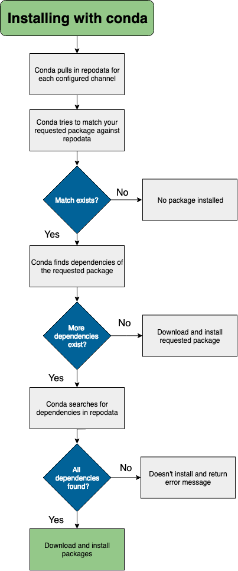

> Sau khi [download](https://docs.conda.io/en/latest/miniconda.html) về tiến hành install

```
bash Miniconda3-latest-Linux-x86_64.sh
```

> Cài đặt miniconda trên Linux

```
rm -rf ~/miniconda
```

> Gỡ cài đặt minicodna

```
rm -rf ~/.condarc ~/.conda ~/.continuum
```

> Gỡ bỏ những file và folder ẩn trong Linux

<br />

<a name="III"></a>
## III _ NHỮNG LỆNH CĂN BẢN:

***

- **1. Lệnh thông dụng:**

```
conda -V
```

> Kiểm tra phiên bản

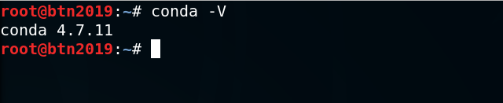

```
conda info --all
```

> Xem thông số miniconda

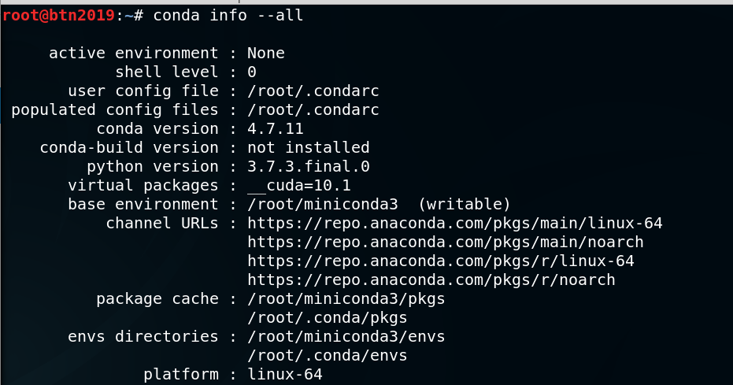

```
conda update conda
conda update -n base -c defaults conda
```

> Cập nhật mới conda

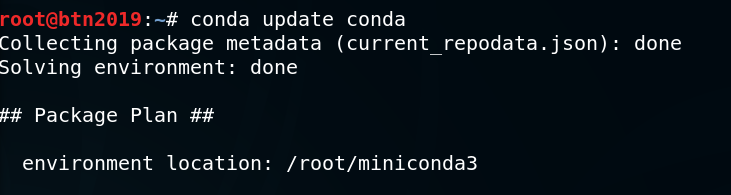

```
conda create -n <env_name> <package_01> <package_02>
conda create -n <env_name>
```

> Khởi tạo môi trường ```<env_name>``` mới. Tham số ```<env_name>``` tên môi trường mới, tham số ```<package_01> <package_02>``` là các gói package install theo, nên có thể bỏ qua tham số này cũng được.

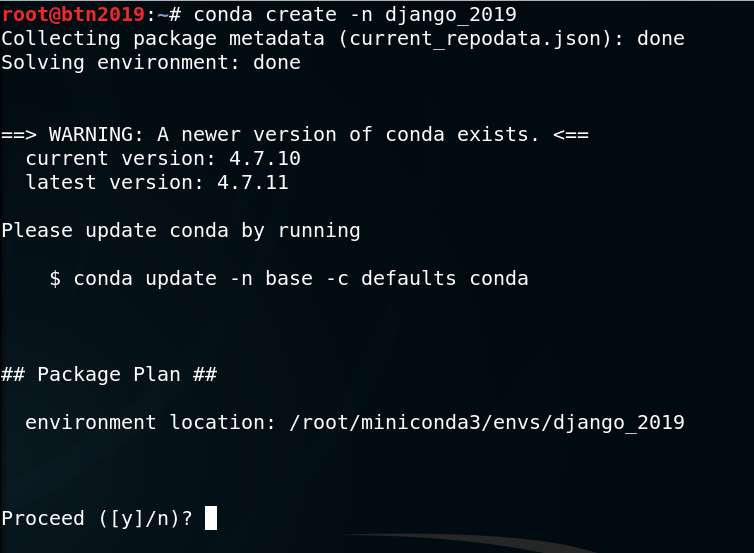

> Chọn **y** để tạo package mới

```
conda create --prefix ./<env_name> <package_01> <package_02>
```

> Khởi tạo môi trường ```<env_name>``` mới đến một path_directory chỉ định, bằng cách thêm tham số ```--prefix```

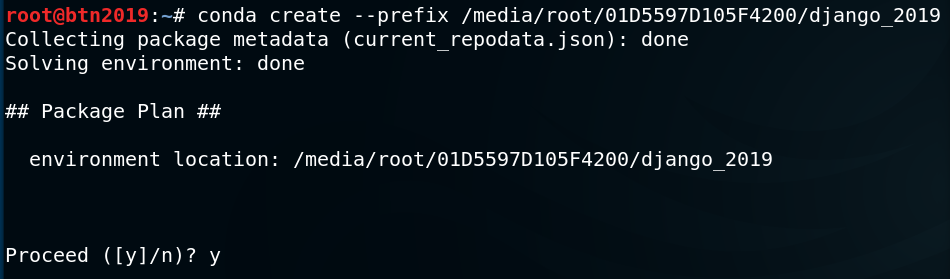

```
conda env remove -n <env_name>
conda env remove --name <env_name>
```

> Dùng để xóa một môi trường ```<env_name>``` trong miniconda

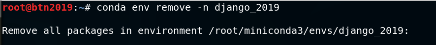

```
conda env remove --prefix ./<env_name>
```

> Dùng để xóa một môi trường ```env_name``` chỉ định trong miniconda

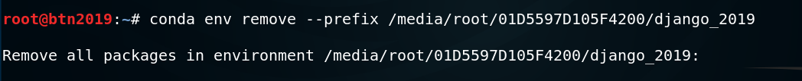

```
conda env list
conda info --envs
```

> Liệt kê những env đã cài đặt trong máy mà Miniconda quản lý.

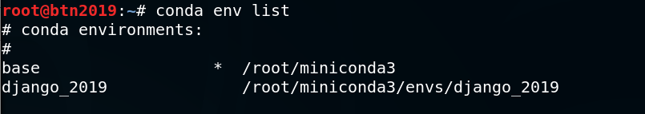

```
conda activate <env_name>
conda activate ./<env_name>
```

> Kích hoạt phiên làm của một môi trường env để bắt đầu công việc


```
conda install -n <env_name> <package_01> <package_02>
```

> Cài đặt ```<package_01> <package_02>``` vào ```<env_name>``` mặc định

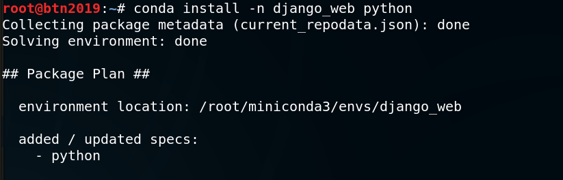

```
conda install --prefix=./<env_name> <package_01> <package_02>
conda install --prefix ./<env_name> <package_01> <package_02>
```

> Cài đặt ```<package_01> <package_02>``` vào một ```<env_name>``` chỉ định 

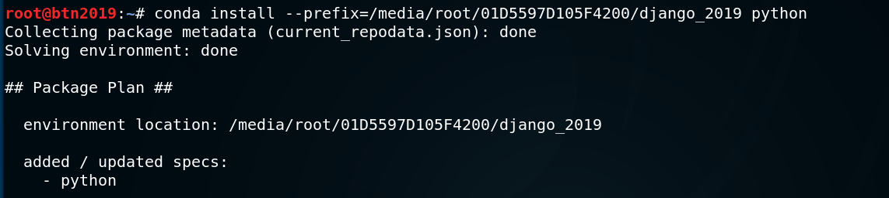

```
conda list
```

> Liệt kê các package đã cài đặt trong ```<env_name>``` hiện tại

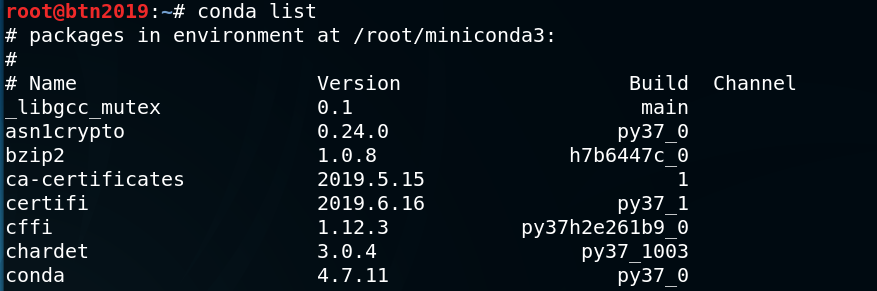

```
conda list -n <env_name>
```

> Liệt kê các package đã cài đặt trong ```<env_name>``` mặc định

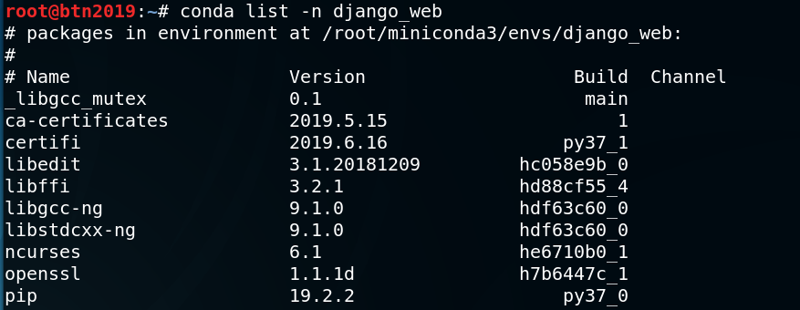

```
conda list --prefix=./<env_name>
conda list --prefix <env_name>
```

> Liệt kê các package đã cài đặt trong ```<env_name>``` chỉ định

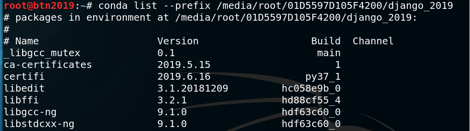

```
conda deactivate
```

> Thoát phiên làm việc.

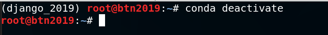

<br />

<a name="IV"></a>
## IV _ NGUỒN THAM KHẢO:

***

- [docs.conda.io](https://docs.conda.io/projects/conda/en/latest/user-guide/install/index.html#)

- [kipalog.com](https://kipalog.com/posts/Cach-su-dung-Miniconda-de-quan-ly-Python-packages)

