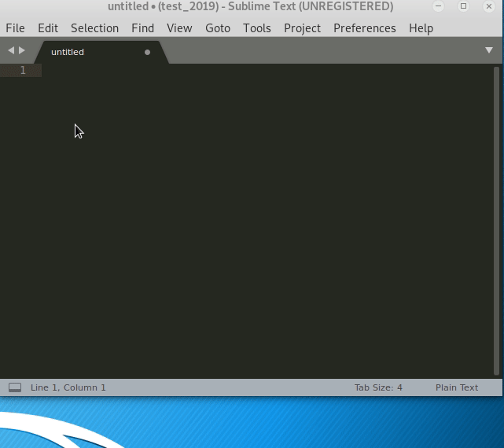
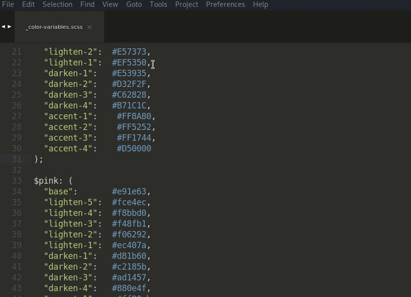

# Sublime Text 2019
---

> Mục đích viết tài liệu này để khi quên xem lại +:)), tại dạo này hay quên quá và ngày càng lười search [google.com](https://www.google.com/)...


> #### Mà vừa nói gì ta ?:))...


## MỤC LỤC

&emsp;&emsp;**[I. TỔNG QUÁT](#I)**

&emsp;&emsp;**[II. CÀI ĐẶT](#II)**

&emsp;&emsp;**[III. NHỮNG THỦ THUẬT CƠ BẢN](#III)**

&emsp;&emsp;&emsp;**[3.1 Thao tác căn bản và những Package thông dụng](#3.1)**

&emsp;&emsp;&emsp;**[3.2 Thay đổi giao diện Sublime Text](#3.2)**

&emsp;&emsp;&emsp;**[3.3 MarkdownPreview](#3.3)**

&emsp;&emsp;&emsp;**[3.4 LiveReload](#3.4)**

&emsp;&emsp;&emsp;**[3.5 Create Terminal using Sublime Text 3 in Kali Linux](#3.5)**

&emsp;&emsp;&emsp;**[3.6 Django Manage Commands](#3.6)**

&emsp;&emsp;&emsp;**[3.7 Writing PEP 8 Python](#3.7)**

&emsp;&emsp;&emsp;**[3.8 SublimeCodeIntel](#3.8)**

&emsp;&emsp;&emsp;**[3.9 Inline Python](#3.9)**

&emsp;&emsp;&emsp;**[3.10 File scss and sass convert to file css](#3.10)**

&emsp;&emsp;&emsp;**[3.11 HTMLBeautify](#3.11)**

&emsp;&emsp;&emsp;**[3.12 CSS Format](#3.12)**

&emsp;&emsp;**[IV. NGUỒN THAM KHẢO](#IV)**

<br />
<a name="I"></a>

### I. TỔNG QUÁT

---

<a name="gt"></a>

**[Giới thiệu](#gt)**

> [Sublime Text 3](https://en.wikipedia.org/wiki/Sublime_Text) là trình soạn thảo mã nguồn đa nền tảng.
> Hỗ trợ nhiều ngôn ngữ lập trình và ngôn ngữ đánh dấu, và người dùng có thể thêm các chức năng bằng các plugin,
> thường được xây dựng bởi cộng đồng và được duy trì theo giấy phép phần mềm miễn phí.

**Khác biệt giữa version Paid và version Free**

> Về mặt tính năng thì không có sự khác biệt nào giữa phiên bản trả phí và miễn phí, ngoại trừ việc sử dụng phiên bản miễn phí thì text editor này sẽ hiển thị một popup nhắc bạn mua bản quyền sau một khoảng thời gian sử dụng nhất định.

<a name="mtth"></a>

**[Môi trường thực hiện:](#mtth)**

+ Operating system: Linux version 5.2.0-kali3-amd64 (NAME="Kali GNU/Linux", VERSION="2019.4")

+ Sublime Text 3: version 3.2.2. Build 3211

+ Key:

```
----- BEGIN LICENSE -----
Member J2TeaM
Single User License
EA7E-1011316
D7DA350E 1B8B0760 972F8B60 F3E64036
B9B4E234 F356F38F 0AD1E3B7 0E9C5FAD
FA0A2ABE 25F65BD8 D51458E5 3923CE80
87428428 79079A01 AA69F319 A1AF29A4
A684C2DC 0B1583D4 19CBD290 217618CD
5653E0A0 BACE3948 BB2EE45E 422D2C87
DD9AF44B 99C49590 D2DBDEE1 75860FD2
8C8BB2AD B2ECE5A4 EFC08AF2 25A9B864
------ END LICENSE ------
```
```
— BEGIN LICENSE —–
ZYNGA INC.
50 User License
EA7E-811825
927BA117 84C9300F 4A0CCBC4 34A56B44
985E4562 59F2B63B CCCFF92F 0E646B83
0FD6487D 1507AE29 9CC4F9F5 0A6F32E3
0343D868 C18E2CD5 27641A71 25475648
309705B3 E468DDC4 1B766A18 7952D28C
E627DDBA 960A2153 69A2D98A C87C0607
45DC6049 8C04EC29 D18DFA40 442C680B
1342224D 44D90641 33A3B9F2 46AADB8F
—— END LICENSE ——

```

<br />
<a name="II"></a>

### II. CÀI ĐẶT

***

+ [Download Sublime Text 3](https://www.sublimetext.com/3)

Do mình thực hiện trên distro Kali Linux nên không cần phải **download**, mà thực hiện lệnh sau:

```
wget -qO - https://download.sublimetext.com/sublimehq-pub.gpg | sudo apt-key add -

sudo apt-get install apt-transport-https

echo "deb https://download.sublimetext.com/ apt/stable/" | sudo tee /etc/apt/sources.list.d/sublime-text.list

sudo apt-get update

sudo apt-get install sublime-text
```

> Cài đặt


```
sudo apt-get remove sublime-text
```

> Gỡ cài đặt


<br />
<a name="III"></a>

### III. NHỮNG THỦ THUẬT CƠ BẢN

***

<a name="3.1"></a>

+ #### **[3.1 Thao tác căn bản và những Package thông dụng](#3.1)**	

Sau khi cài đặt xong tiến hành cài gói Package Control, gói này để dùng cài đặt những gói package khác.

Truy cập vào [đây](https://packagecontrol.io/installation#st3) để copy code tương ứng sublime text 3 hoặc 2. Hoặc:

> copy Code:

```
import urllib.request,os,hashlib; h = '6f4c264a24d933ce70df5dedcf1dcaee' + 'ebe013ee18cced0ef93d5f746d80ef60'; pf = 'Package Control.sublime-package'; ipp = sublime.installed_packages_path(); urllib.request.install_opener( urllib.request.build_opener( urllib.request.ProxyHandler()) ); by = urllib.request.urlopen( 'http://packagecontrol.io/' + pf.replace(' ', '%20')).read(); dh = hashlib.sha256(by).hexdigest(); print('Error validating download (got %s instead of %s), please try manual install' % (dh, h)) if dh != h else open(os.path.join( ipp, pf), 'wb' ).write(by) 
```

Tổng hợp phím ```Ctrl + ~```, Pase vô và Enter


Tổng hợp phím ```Ctrl + Shift + P``` gõ install Enter, bắt đầu install những package hỗ trợ công việc


+ **SidebarEnhancemments**

> Package này tạo ra các context menu với nhiều tiện ích tốt như open in brower



+ **AutoFileName**

> Package này sẽ hiển thị ra tất cả các file có trong thư mục để các bạn có thể nhúng file đơn giản hơn


+ **Color Picker**

> Package này giúp cho chúng ta có thể lấy được mã màu mà không cần dùng đến photoshop.
> Để mở chúng ta nhấn tổng hợp phím ```Ctrl + Shift + C```


+ **Color HighLighter**

> Package này giúp bạn code css hay hơn bằng cách hiển thị luôn màu sắc của mã màu



+ **Remove Package**

> Remove Package SidebarEnhancemments


<a name="3.2"></a>

+ #### **[3.2 Thay đổi giao diện Sublime Text](#3.2)**

Tham khảo bài viết tại [đây](https://ehkoo.com/bai-viet/sublime-text-3-themes), nhấn tổng hợp phím ```Ctrl + Shift + p``` gõ install rồi Enter, nhập vào tên theme cần cài đặt rồi Enter (Ví dụ: Theme Afterglow)


Settings for Afterglow

```
{
    "theme": "Afterglow.sublime-theme",
    "color_scheme": "Packages/Theme - Afterglow/Afterglow.tmTheme"
}
```

Settings for Afterglow-blue

```
{
    "theme": "Afterglow-blue.sublime-theme",
    "color_scheme": "Packages/Theme - Afterglow/Afterglow.tmTheme"
}
```

Settings for Afterglow-magenta

```
{
    "theme": "Afterglow-magenta.sublime-theme",
    "color_scheme": "Packages/Theme - Afterglow/Afterglow.tmTheme"
}
```

Settings for Afterglow-orange

```
{
    "theme": "Afterglow-orange.sublime-theme",
    "color_scheme": "Packages/Theme - Afterglow/Afterglow.tmTheme"
}
```

Settings for Afterglow-green

```
{
    "theme": "Afterglow-green.sublime-theme",
    "color_scheme": "Packages/Theme - Afterglow/Afterglow.tmTheme"
}
```


<a name="3.3"></a>

+ #### **[3.3 MarkdownPreview](#3.3)**

> Package MarkdownPreview hỗ trợ trong việc hiển thị nội dung bài viết tài liệu bằng **markdown**
>
> Install theo hướng dẫn sau


> Sử dụng: Ctrl + Shift + P -> Markdown Preview: Preview in Brower -> markdown


<a name="3.4"></a>

+ #### **[3.4 LiveReload](#3.4)**

> Package LiveReload đi kèm với Package MarkdownPreview, để mỗi khi ***Save*** có thay đổi gì ở file markdown thì web Brower sẽ cập nhật mới
>
> Install package:


> Thiết lập thao tác ***Save***:
> 
> - Ctrl + Shift + P **-->** LiveReload: Enable/disable plug-ins **-->** Enable - Simple Reload


<a name="3.5"></a>

+ #### **[3.5 Create Terminal using Sublime Text 3 in Kali Linux](#3.5)**

> Tạo Build system Terminal để chạy file python. Tools -> Build System -> New Build System, copy command dưới vào và đặt tên là python_terminal

```
{ 
"cmd": ["gnome-terminal -e 'bash -c \"python3 -u $file;echo;echo Press ENTER to exit; read line\"'"], 
"shell": true 
}
```


> Tool -> Build System -> python_terminal, hưởng thành quả đạt được thôi

<a name="3.6"></a>

+ #### **[3.6 Django Manage Commands](#3.6)**

> Package dùng để quản lý Django tìm hiểu thêm [tại đây](https://packagecontrol.io/packages/Django%20Manage%20Commands)


> [Django manage commands](https://github.com/vladimirnani/DjangoCommands/issues/40), hoặc theo mẫu: Preferences -> Package Settings -> Django Manage Commands -> Settings
>
> Coppy và Pase:

```
{
"browser_after_runserver": "true",
"python_virtualenv_paths": "path_virtualenv",
"python_bin" : "path_python",
"django_project_root":"path_django",
}
```


>
> - ```path_virtualenv```: đường dẫn đến folder [virtualenv](./virtualenv.md)
>
> - ```path_python```: đường dẫn đến python
>
> - ```path_django```: đường dẫn đến Folder Project Django
>
> Save lại

<a name="3.7"></a>

+ #### **[3.7 Writing PEP 8 Python](#3.7)**

> Preferences -> Settings
>
> ```
> "font_size": 12,
> // World wrapping - follow PEP 8 recomendations
> "rulers": [72,79],
> "word_wrap":true,
> "wrap_width":80,
> ```
>
> Copy và Pase

<a name="3.8"></a>

+ #### **[3.8 SublimeCodeIntel](#3.8)**

> Package này giúp dễ dàng tìm ra các function, class,.. đang sử dụng được viết ra từ đâu
>
> Phím trong Linux: Super + Click

<a name="3.9"></a>

+ #### **[3.9 Inline Python](#3.9)**

> Package này giúp code Python nhanh hơn, gợi ý function, class, model,...

<a name="3.10"></a>

+ #### **[3.10 File scss and sass convert to file css](#3.10)**

> Trước tiên install Package SASS (trong Package SASS gồm cả SCSS), để Sublime Text hỗ trợ cú pháp
>
<!-- > OS Window yêu cầu: install [ruby](https://rubyinstaller.org/downloads/), ***ruby -v*** để kiểm tra phiên bản ruby (dùng ruby.7z, khi giải nén xong thiết lập trong $PATH ... ruby/bin) -->
>
<!-- > Mở ***cmd*** quyền Admin, install theo mẫu sau ```gem install sass``` -->
> 


<!-- > Kiểm tra đã install ruby chưa ```ruby -v``` -->

> Install package ***SASS Build***, dùng để build sang file css
>
> - Để thiết lập build sang file css: Tools -> Build System -> SASS - Compressed


> - Để Build từ file scss và sass sang file css ***Ctrl + B***

<a name="3.11"></a>

+ #### **[3.11 HTMLBeautify](#3.11)**

> Package hỗ trợ Format code file html để dễ nhìn
>
> Instal và sử dụng theo hướng dẫn sau
>
> Phím tắt trong Linux: ***Shift + Ctrl + Alt + F***


<a name="3.12"></a>

+ #### **[3.12 CSS Format](#3.12)**

> CSS Format là Package hỗ trợ Format file css theo nhiều chuẩn: Expanded, Compact, Compressed,... Chuẩn ***Expanded*** được dùng để khi code
>
> Phím tắt trong Linux: ***Ctrl + Shift + P*** -> Format CSS: XXX**


<br />
<a name="IV"></a>

### IV. NGUỒN THAM KHẢO

***

+ [Sublime Text 3](https://sublime-text-unofficial-documentation.readthedocs.io/en/latest/intro.html)

+ [toidicode.com](https://toidicode.com/tong-hop-cac-sublime-text-package-cho-web-developer-89.html)

+ [lar.vn](https://lar.vn/huong-dan-tai-va-su-dung-sublime-text-de-lap-trinh-moi-thu.html)