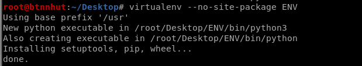

# Virtualenv
---

> Mục đích viết tài liệu để khi quên có cái để mà xem lại. Tại dạo này hay quên và ngày càng lười search [google.com](https://www.google.com) và [youtube.com](https://www.youtube.com)...


> #### Mà vừa nói gì vậy ta ?:))... lại quên nữa rồi thôi đi nghỉ ngơi đây...

<a name="0"></a>

## [MỤC LỤC](#0)
---

- #### [I. TỔNG QUÁT](#I)

	- #### [1.1 Giới thiệu](#I_01_01)

	- #### [1.2 Môi trường thực hiện](#I_01_02)

- #### [II. INSTALL - CÀI ĐẶT](#II)
	
	- #### [2.1 Install pip](#II_01)

	- #### [2.2 Install virtualenv](#II_02)

	- #### [2.3 Căn bản Virtualenv - Basic Virtualenv](#II_03)

		- [2.3.1 Tạo Virtualenv Environment](#II_03_01)

		- [2.3.2 Activate Virtualenv](#II_03_02)

		- [2.3.3 Thoát Virtualenv](#II_03_03)

		- [2.3.4 Đồng bộ Virtualenv](#II_03_04)

		- [2.3.5 Xóa Virtualenv](#II_03_05)

		- [2.3.6 Install Package trong Virtualenv](#II_03_06)

		- [2.3.7 Danh sách Package đã install trong Virtualenv](#II_03_07)

- #### [III. NGUỒN THAM KHẢO](#III)

<a name="I"></a>

### [I. TỔNG QUÁT](#I)

---

<a name="I_01_01"></a>

- #### [1.1 Giới thiệu](#I_01_01)

> [Virtualenv](https://virtualenv.pypa.io/) là một package viết bằng Python, giúp tạo ra các "môi trường ảo", để tách biệt các môi trường của các project khác nhau.
> Mỗi "môi trường ảo" về bản chất chỉ là một folder, với một vài thay đổi khiến cho khi ta dùng pip để cài package, và các package này sẽ được cài vào folder này. Điều này giải quyết được:
>> - Tách biệt các môi trường giữa các project, 2 project có thể dùng 2 phiên bản khác nhau của cùng 1 package.
>> - Người dùng có thể tạo "môi trường ảo" trong một Folder của mình không ảnh hưởng đến hệ thống. Virtualenv hoạt động nhờ vào cách mà Python thực hiện [import](https://docs.python.org/3/tutorial/modules.html#the-module-search-path)

<a name="I_01_02"></a>

- #### [1.2 Môi trường thực hiện](#I_01_02)

+ Operating system: Linux version 5.2.0-kali3-amd64 (NAME="Kali GNU/Linux", VERSION="2019.4")

+ Virtualenv version: virtualenv-16.7.7 

<a name="II"></a>

### [II. INSTALL - CÀI ĐẶT](#II)

---

> Để install virtualenv trước tiên phải install package [pip](https://pip.pypa.io/en/stable/installing/), pip là một package quản lý Module/Package cho Python. Cài đặt ```pip``` theo hướng dẫn [tại đây](https://packaging.python.org/guides/installing-using-linux-tools/#installing-pip-setuptools-wheel-with-linux-package-managers) dành cho Linux tìm phiên bản phù hợp với Linux của mình nhe, hoặc theo mẫu sau:

<a name="II_01"></a>

- #### [2.1 Install pip](#II_01)

Python 2:

```
sudo apt install python-pip
```

Dùng ```pip --version``` kiểm tra phiên bản đã cài đặt

Python 3:

> Trong bài này mình sẽ dùng pip3

```
sudo apt install python3-pip
```

Dùng ```pip3 --version``` kiểm tra phiên phản đã cài đặt


<a name="II_02"></a>

- #### [2.2 Install virtualenv](#II_02)

> Do bài này dùng python3-pip, để cài đặt virtualenv làm theo mẫu sau

```
pip3 install virtualenv
```


Dùng ```virtualenv --version``` kiểm tra phiên bản đã cài đặt


<a name="II_03"></a>

- #### [2.3 Căn bản Virtualenv - Basic Virtualenv](#II_03)

	<a name="II_03_01"></a>

	- [2.3.1 Tạo Virtualenv Environment](#II_03_01)

	```
	virtualenv <project_name>
	```

	> Tạo Virtualenv "ENV"

	

	> Hoặc tạo Virtualenv mà không có các package có sẵn

	```
	virtualenv --no-site-package <project_name>
	```

	

	<a name="II_03_02"></a>

	- [2.3.2 Activate Virtualenv](#II_03_02) 

	> Để bắt đầu cài đặt các package cho project

	```
	source <project_name>/bin/activate
	```

	

	<a name="II_03_03"></a>

	- [2.3.3 Thoát Virtualenv](#II_03_03)

	```
	deactivate
	```

	

	<a name="II_03_04"></a>

	- [2.3.4 Đồng bộ Virtualenv](#II_03_04)

	> Đồng bộ môi trường ảo của project để các lập trình viên hay triển khai mã nguồn lên máy mới. Xuất ra các package trong Virtualenv để đồng bộ

	```
	pip3 freeze > config_vir.txt
	```
	

	> Sau đó sử dụng config_vir.txt để tạo ra cấu hình Virtualenv đồng nhất cho các Virtualenv mới khác

	```
	pip3 install -r config_vir.txt
	```
	
	

	<a name="II_03_05"></a>

	- [2.3.5 Xóa Virtualenv](#II_03_05)

	```
	rm -rf ENV
	```

	

	<a name="II_03_06"></a>

	- [2.3.6 Install Package trong Virtualenv](#II_03_06)

	```
	pip3 install <package_name>
	```

	> Đây sẽ instal package pyqt5

	 

	<a name="II_03_07"></a>

	- [2.3.7 Danh sách Package đã install trong Virtualenv](#II_03_07)

	```
	pip3 list
	```

	

	> Để biết thêm nhiều lệnh khác ```pip3 --help```

> Để chạy code trong Sublime Text 3, phải [Build System](https://www.sublimetext.com/docs/3/build_systems.html) lại, hoặc làm như sau trong Sublime Text 3 : Tools -> Build System -> New Build System

```
{
    "cmd": ["python", "$file"],
    "selector": "source.python",
    "file_regex": "^\\s*File \"(...*?)\", line ([0-9]*)"
}
```

> Copy và Pase xong 
>
> Thay đổi "python" thành "path_project" của Virtualenv
>
> Save lại thành ```python_vir```, vào Tools -> Build System -> python_vir
>
> Vào Tools -> Build để kiểm tra lại

<a name="III"></a>

### [III. NGUỒN THAM KHẢO](#III)

---

- [Virtualenv](https://virtualenv.pypa.io/)

- [pip](https://pip.pypa.io/)